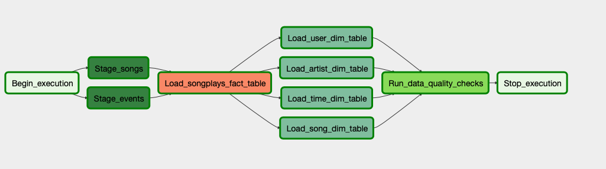

# Data Pipelines with Airflow
This projects implements an ETL pipeline to transfers data from files in a S3 bucket to analytics tables on redshift using Airflow.
The data resides in S3, in a directory of JSON logs on user activity, as well as a directory with JSON metadata on the songs.
The project defines fact and dimension tables for a star schema.

# Porject Structure
- **plugins/helpers/sql_queries.py**: Contains the SQL statements for inserting values into the staging, fact and dimension tables
- **plugins/helpers/data_quality.py**: Cotains the definition of the data quality checks to be performed
- **operators**: Python code for the different custom operators such as staging the data, filling the data warehouse, and running checks on the data as the final step
- **create_tables.sql**: SQL statements to create the tables on AWS redshift

# Data Set
The data consists of a song and a log data set for song play analysis.

### Song Data Set
The song dataset is a subset of real data from the Million Song Dataset. Each file is in JSON format and contains metadata about a song and the artist of that song. The files are partitioned by the first three letters of each song's track ID.
The song dataset resides in a S3 bucket and this is the link for it:
```s3://udacity-dend/song_data```
Here are filepaths to two files in this dataset:
```
song_data/A/B/C/TRABCEI128F424C983.json
song_data/A/A/B/TRAABJL12903CDCF1A.json
```
And below is an example of what a single song file looks like.
```
{"num_songs": 1, "artist_id": "ARJIE2Y1187B994AB7", "artist_latitude": null, "artist_longitude": null, "artist_location": "", "artist_name": "Line Renaud", "song_id": "SOUPIRU12A6D4FA1E1", "title": "Der Kleine Dompfaff", "duration": 152.92036, "year": 0}
```

### Log Data Set
The second dataset consists of log files in JSON format generated by this [event simulator](https://github.com/Interana/eventsim) based on the songs in the dataset above. These simulate activity logs from a music streaming app based on specified configurations.
The log data set resides in a S3 bucket and this is the link for it:
```s3://udacity-dend/log_data```
To properly load the log data into tables on the redshift a json path needs to be used:
```s3://udacity-dend/log_json_path.json```

The log files in the dataset you'll be working with are partitioned by year and month. For example, here are filepaths to two files in this dataset:
```
log_data/2018/11/2018-11-12-events.json
log_data/2018/11/2018-11-13-events.json
```
And below is an example of what the data in a log file, 2018-11-12-events.json, looks like.


# Tables
The data pipeline fills the following tables on an hourly schedule:

### Fact Tables
**songplays** - records in log data associated with song plays i.e. records with page ```NextSong```
songplay_id, start_time, user_id, level, song_id, artist_id, session_id, location, user_agent

### Dimension Tables
- **users** - users in the app
user_id, first_name, last_name, gender, level

- **songs** - songs in music database
song_id, title, artist_id, year, duration

- **artists** - artists in music database
artist_id, name, location, lattitude, longitude

- **time** - timestamps of records in songplays broken down into specific units
start_time, hour, day, week, month, year, weekday
  
# Data Pipeline
The ```udac_example_dag.py``` script creates the following DAG:

